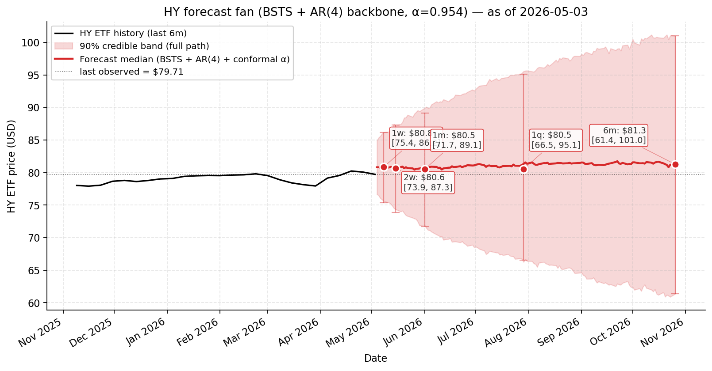
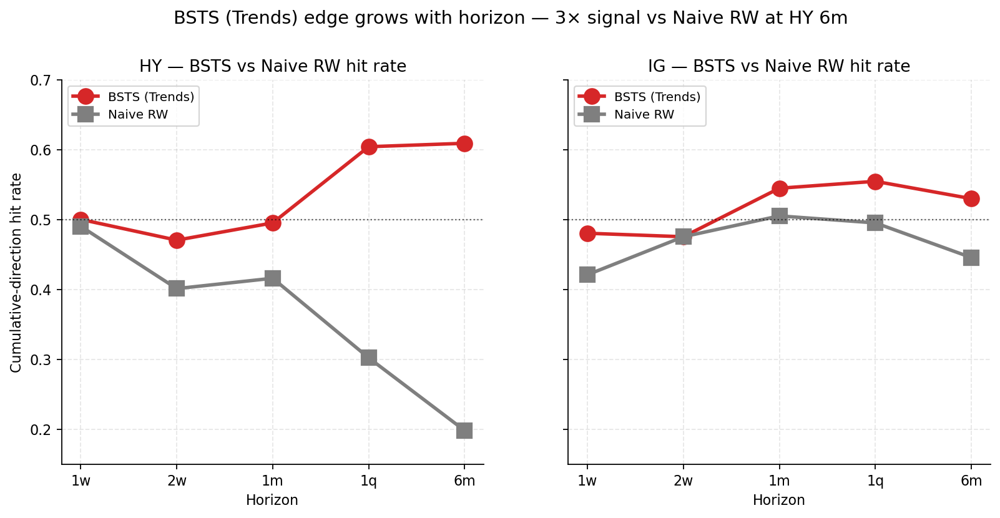
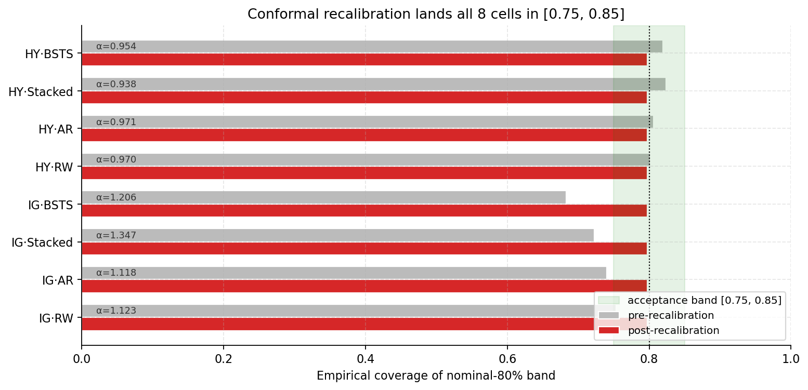

# gtrends-bayes

**Bayesian Structural Time Series forecasting of High-Yield (HY) and Investment-Grade (IG) corporate-bond spreads using Google Trends predictors.**


Built by **Cesare Bavaresco** for **Neuberger Berman**, as part of the **University of Chicago Project Lab**.

<p align="center">
  
</p>

---

## Overview

`gtrends-bayes` turns search behavior into a forward-looking credit signal. A
curated universe of **41 Google Trends predictors** (labor, credit & lending,
consumption, distress, industrial, and related categories) is preprocessed
following the OECD search-data methodology (Woloszko, 2020) — deseasonalized,
bias-corrected, and break-adjusted — and fed into a **Bayesian Structural Time
Series (BSTS)** model (Steven L. Scott's R `bsts` engine, accessed via `rpy2`,
in the spirit of Varian, 2023).

The model forecasts **HY / IG corporate-bond spreads** (using the HYG and LQD
ETFs as proxies for the underlying OAS) across **five horizons from one week to
one quarter**. It is framed as a **Trends-driven risk overlay** on an `AR(4)`
backbone — a *supplement* to, not a replacement for, the autoregressive
baseline — producing a probabilistic forecast (median plus credible bands) at
each horizon.

## Results

**The Trends signal pays off when the autoregressive backbone has the least to
say.** On the PM-relevant metric — cumulative directional hit rate — BSTS (Trends)
beats a naive random walk at long horizons, with roughly **3× the signal on HY at
six months (0.61 vs 0.20)** and 0.60 vs 0.30 at one quarter.

<p align="center">
  
</p>

| Target | Model | 1w | 1m | 1q | 6m |
|---|---|---:|---:|---:|---:|
| HY | BSTS (Trends) | 0.50 | 0.49 | **0.60** | **0.61** |
| HY | Naive RW | 0.49 | 0.42 | 0.30 | 0.20 |
| IG | BSTS (Trends) | 0.48 | 0.54 | 0.55 | 0.53 |
| IG | Naive RW | 0.42 | 0.51 | 0.49 | 0.45 |

The forecast bands are **calibrated**: a conformal recalibration multiplier learned
in-sample lands all 8 (target, model) coverage cells in the [0.75, 0.85] acceptance
band around the 80% nominal target.

<p align="center">
  
</p>

The honest caveats matter as much as the headline — the LQD↔IG-OAS proxy is weak,
crisis recall is partial, and the daily Risk Index is a visualization layer rather
than a significance test. **See [`docs/RESULTS.md`](docs/RESULTS.md) for the full
results, predictor-inclusion breakdown, Trends Risk Index evaluation, and caveats.**

## Repository structure

```
src/gtrends_bayes/    Core package
  data/               Trends + financial (FRED, ETF) data clients and loaders
  preprocessing/      OECD-style pipeline (seasonality, bias removal, breaks)
  features/           Predictor library + Trends risk index
  models/             BSTS, AR baseline, posterior, stacked residual
  backtest/           Walk-forward evaluation, metrics, recalibration
  inference/          Frozen-model forecast API + CLI
  viz/                Plotting helpers
scripts/              Pipeline entry points (pull → preprocess → fit → sweep)
config/               YAML config: predictors, targets, model, ingest
notebooks/            Exploratory + presentation notebooks
docs/                 Versioned usage docs (v4, v5) + RESULTS.md write-up
data/                 Datasets + model artifacts (not shipped — see data/README.md)
tests/                Test suite (251 tests)
```

## Requirements

- **Python ≥ 3.11**
- **R** with the `bsts`, `Boom`, and `BoomSpikeSlab` packages (for model fitting)
- A free **FRED API key** — https://fred.stlouisfed.org/docs/api/api_key.html

> **Note on data & model artifacts.** The datasets and frozen `.pkl` models this
> project was built on are proprietary (produced for Neuberger Berman) and are **not
> included** in this repository. The pipeline still runs end-to-end on synthetic
> inputs (below), and the data schema is documented in
> [`docs/v5/data_README.md`](docs/v5/data_README.md) and
> [`data/README.md`](data/README.md).

## Quickstart — no data required

The inference layer is pure Python (no R, no data, no model pickle needed). Its test
suite runs the full forecast API end-to-end against a synthetic frozen-model fixture,
so you can confirm it works in one command:

```bash
make install                          # install the package + dev tools into .venv
pytest tests/test_inference.py        # forecast API end-to-end on a synthetic model (no data, no R)
```

With a frozen model pickle present in `model/`, `python scripts/example_forecast.py`
prints a full forecast report over both targets and the PM horizon ladder (add
`--real` to use `data/*_history.csv` inputs). The frozen pickles are proprietary and
not shipped here.

## Full pipeline

The end-to-end pipeline is driven by `make` (see `make help` for all targets). It
requires a FRED API key and the R packages above:

```bash
cp .env.example .env   # then add your FRED_API_KEY
make r-deps            # install the required R packages

make pull-trends       # pull the configured Trends predictors into data/raw/
make preprocess        # run the OECD-style preprocessing pipeline
make fit               # fit BSTS for both targets (HY, IG)
make horizon-sweep     # walk-forward sweep across the 5 horizons
make test              # run the test suite with coverage
```

For inference from a frozen model (if you have produced one), a single
horizon-step-ahead forecast can be run via the module CLI:

```bash
python -m gtrends_bayes.inference \
  --model-path model/HY_v5.pkl \
  --horizon 1m \
  --as-of 2026-05-15 \
  --y-data data/HY_history.csv \
  --x-data data/trends.parquet
```

See `docs/v5/` (`USAGE.md`, `BOOTSTRAP.md`) for full guidance, and
[`docs/RESULTS.md`](docs/RESULTS.md) for the results and methodology write-up.

## Methodology references

- Steven L. Scott — Bayesian Structural Time Series (the R `bsts` package)
- Hal Varian (2023) — nowcasting / forecasting with Google Trends
- Nicolas Woloszko (2020), OECD — search-data preprocessing methodology

## Author

**Cesare Bavaresco** — built for Neuberger Berman as part of the University of
Chicago Project Lab.

## License

Proprietary — **All Rights Reserved**. See [LICENSE](LICENSE). This software, its
data, and model artifacts are confidential; no use, copying, or distribution is
permitted without prior written consent.
